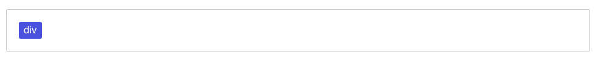
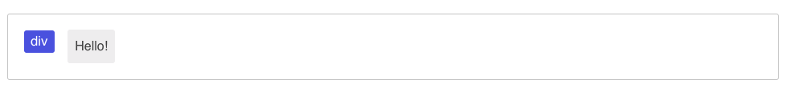

	

# What is Onwebed?

- **Lets You Code HTML Visually** - Onwebed is a visual way to create HTML documents. HTML can get messy at times, Onwebed keeps it clean!

- **Helps Create Dynamic Sites** - It doesn't settle with static pages, it's powerful enough to create fully-featured dynamic sites, housing a markup language, Django's templating engine, and lots more!

- **Simple** - Every Onwebed document is composed of *boxes*, making it consistent and easy to learn.

- **Extensible** - The concept of boxes make it extremely easy to extend the features of Onwebed. Define your own boxes whenever you wish.

- **It's Hybrid** - Sometimes visual editing isn't efficient, that's when markup languages come into play, Onwebed lets you use both.

- **Makes Web Development Less Redundant** - Its simple, yet powerful templating system makes web development least redundant.

- **Not WYSIWYG** - Onwebed visualizes structure, not looks and feel.

- **Powered by Django** - It's built on top of Django and inherits all its features, letting you use Django's templating engine and more!

# Basic Concepts

## Boxes

Every single page built with Onwebed is composed of *boxes*.

Boxes are converted to HTML when a person visits your page.

Each box has a label, and may have some textual content, or may hold yet more boxes.

A box which holds text is called a **liquid box**, and a box which holds other boxes is called a **solid box**.

Each box may have a label, which defines it. The label is used primarily for converting a box to HTML.

Here's an empty solid box labeled, "div."

Here's that solid box, empty no more, as it holds a liquid box which contains the text "Hello."

This is how a small, simple page may look like:

As you can see, it's like coding HTML, but in a visual way!